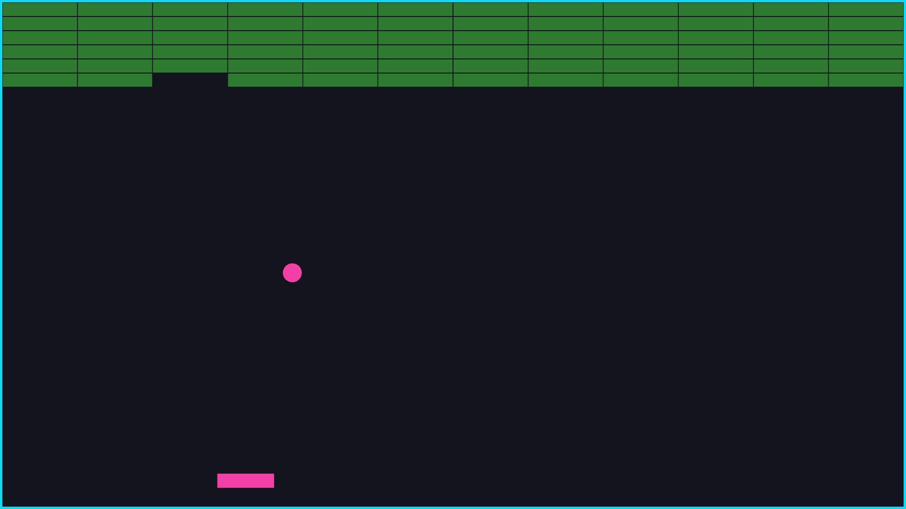
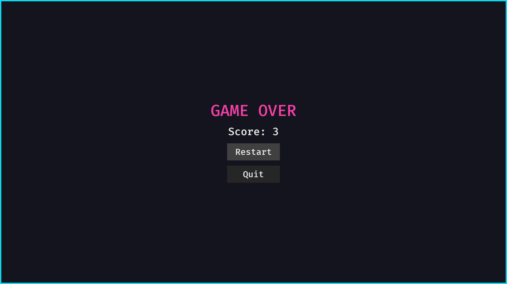

# Breakout Game

A classic breakout/brick breaker game built with Rust and the Bevy game engine.

## Description

Control a paddle to bounce a ball and destroy all the blocks on the screen. The ball's angle changes based on where it hits the paddle, adding a strategic element to the gameplay. Score points by breaking blocks and try to keep the ball in play!

## Features

- **Dynamic paddle physics**: Ball angle varies based on hit position on paddle
- **Score tracking**: Earn points for each block destroyed
- **Sound effects**: Audio feedback for collisions
- **Responsive controls**: Smooth paddle movement
- **Game states**: Menu, playing, and game over screens

#### Screenshot



## Controls

- **Left/Right Arrow Keys** or **A/D**: Move paddle
- **Mouse**: Click buttons in menus

## Requirements

- Rust (latest stable version)
- Cargo

## Installation

1. Clone the repository:
```bash
git clone <repository-url>
cd <repository-name>
```

2. Build and run:
```bash
cargo run --release
```

## How to Play

1. Launch the game and click "Play"
2. Move the paddle to bounce the ball
3. Break all blocks to win
4. Don't let the ball fall off the bottom of the screen
5. Hit the ball with different parts of the paddle to control its angle

## Built With

- [Rust](https://www.rust-lang.org/)
- [Bevy](https://bevyengine.org/) - Game engine

## License

This project is licensed under the MIT License - see the [LICENSE](LICENSE) file for details.
